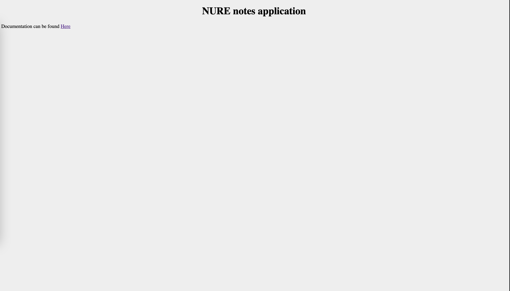
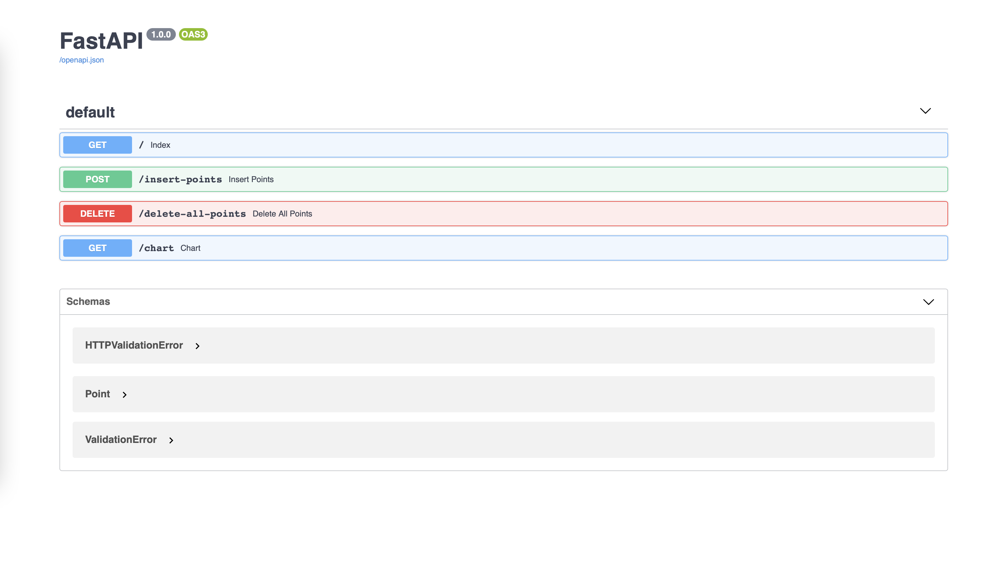
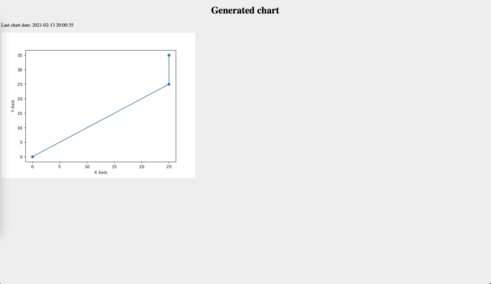

# Python project for NURE university

This project provide API server that implements some functionalities
related to chart drawing based on database data

Provided functionalities:

* Insert point list(`/insert-points`)
* Delete all existing points from database(`/delete-all-points`)
* Show generated chart in runtime(`/chart`)

For more information (Swagger docs) visit the `/docs`.


## Prerequisites

* Python 3.9+


## Setup
```shell
python3.9 -m venv venv
source venv/bin/active
pip install -r requirements.txt
```

## Startup
Before startup ensure that you already have configured env. 
After startup application will be started on the [localhost:8000](http://localhost:8000)
```shell
uvicorn plotter.main:application
```

## Project images

### Index page



### Documentation page



### Chart page
